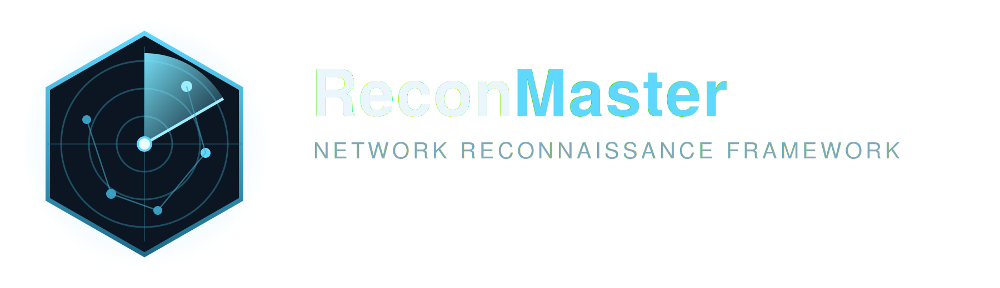

<p align="center">
  
</p>

<h1 align="center">ReconMaster</h1>
<p align="center"><b>Professional Nmap-Based Network Reconnaissance & Security Assessment Toolkit</b></p>

<p align="center">
  
  
  
  
</p>

---

## 1. Project Overview

ReconMaster is a Python framework that wraps standard [Nmap](https://nmap.org)
functionality behind a professional [Rich](https://github.com/Textualize/rich)
terminal interface. It was built as a BS Cyber Security university project and
is suitable for authorized penetration testing, security labs, CTFs, and
network assessment work — host discovery, port scanning, service/OS
detection, NSE scripting, and firewall/filtering analysis, with configurable
timeouts, multi-task scan jobs, and multi-format reporting.

## 2. Objective

Provide a single, well-tested tool that:
- automates legitimate, standard Nmap options through a clean interface,
- lets an analyst combine several reconnaissance steps into one job with
  one aggregated report, instead of running and tracking each scan by hand,
- produces submission-ready reports (TXT/XML/JSON/HTML/PDF) suitable for a
  lab writeup or a professional engagement deliverable,
- runs the same way on Linux, macOS, and Windows.

## 3. Key Features

- Host discovery, TCP/UDP port scanning (SYN, Connect, UDP, full, fast, top-N, custom ports/ranges)
- Service & version detection, OS detection with optional traceroute
- Multi-threaded socket-based banner grabbing — a first-class task in multi-task jobs, not a bolt-on
- NSE script scanning: single category, a custom script name, or **multiple categories combined into one Nmap invocation**
- 29 standard Nmap firewall/filtering-analysis techniques, individually or **multiple at once**, with automatic conflict detection and grouping
- Aggressive scan mode (`-A`) and validated custom Nmap command entry
- **Multi-Task Scan**: select several scan types in one go, run them in a sensible order, skip redundant work automatically, get one aggregated report
- **Configurable, scan-type-specific timeouts** — Default / Custom / No application timeout
- Settings persisted to `config.json`
- Reports in **TXT, XML, JSON, HTML, and PDF** — single-scan or aggregated multi-task reports
- Rotating daily logs; graceful, professional error handling throughout
- Interactive Rich menu **and** a scriptable `--cli` mode
- Cross-platform setup scripts (`setup.sh` / `setup.ps1`) and automatic environment/dependency validation
- Hardened input handling: no `eval()`, no `shell=True`, strict target/port/filename/script-name validation
- 82 unit tests, subprocess mocked — no live network/Nmap required to run the suite

## 4. Architecture

```
main.py        entry point — env warning, Nmap check, dispatches to menu or CLI
menu.py        interactive Rich menu (quick single-task items + Multi-Task Scan + Settings)
cli.py         non-interactive argparse-based CLI
scanner.py     builds Nmap argument lists, executes via subprocess (never shell=True)
banner.py      concurrent socket-based banner grabbing (not Nmap-based)
firewall.py    29 firewall/filtering-analysis techniques + combination validation
nse.py         NSE script category mapping and script-name validation
job.py         ScanTask/ScanJob — multi-task orchestration, ordering, redundancy skipping
report.py      TXT/XML/JSON/HTML/PDF generation — single-scan and aggregated reports
parser.py      best-effort text parsing of Nmap output for reports
config.py      paths, per-scan-type timeout defaults, Nmap option maps
settings.py    config.json persistence, timeout-mode resolution
environment.py Python/venv/dependency/Nmap detection (read-only, no side effects)
logger.py      rotating daily logging
tests/         unit tests, subprocess mocked
```

See `docs/architecture.md` and `docs/workflow.md` for more detail, and
`docs/flow_diagram.txt` for an ASCII data-flow diagram.

## 5. Supported Scan Types

| Type | Notes |
|---|---|
| Host Discovery | `-sn` ping sweep |
| Port Scan | SYN, Connect, UDP, full, fast, top-100/1000, specific ports or a range |
| Service/Version Detection | `-sV`, optionally with default scripts |
| Banner Grabbing | socket-based, not Nmap — runs as its own task in a multi-task job |
| OS Detection | `-O`, optional traceroute |
| NSE Script Scan | see below |
| Firewall Assessment | see below |
| Aggressive Scan | `-A` |
| Custom Nmap Command | validated, sanitized argument entry |

## 6. Multi-Task Scanning

Select several tasks at once instead of running them one at a time:

```
Select scan tasks
 1. Host Discovery
 2. Port Scan
 3. Service/Version Detection
 4. Banner Grabbing
 5. OS Detection
 6. NSE Script Scan
 7. Firewall Assessment
 8. Aggressive Scan
Select scan tasks: 1,2,3,4
```

Input like `1,2,2,99,4` is handled gracefully: invalid numbers and
duplicates are reported and dropped, and the valid selection (`1,2,4`) is
confirmed before continuing. Tasks run in a fixed order (Host Discovery →
Port Scan → Service Detection → Banner Grabbing → OS Detection → NSE →
Firewall Assessment → Aggressive Scan); redundant work is skipped
automatically (e.g. Service/Version Detection is skipped if Aggressive Scan
is also selected, since `-A` already covers it). If one task fails or times
out, the rest still run, and a summary reports how many tasks completed,
failed, timed out, or were skipped. One aggregated report is produced at
the end, sectioned per task, in as many formats as you select.

## 7. NSE Script Scanning

Choose a single category, type an individual script name, or select
**multiple categories** (`default`, `safe`, `discovery`, `http`, `ftp`,
`dns`, `ssh`, `ssl`, `smb`, `smtp`, `snmp`, `auth`, `broadcast`, `vuln`,
`malware`) — multiple selections are combined into one Nmap invocation
(`--script default,safe,vuln`) rather than run as separate scans.

## 8. Firewall/Filtering Analysis

`firewall.py` implements 29 standard, publicly documented Nmap
filtering/firewall rule-set analysis techniques: ACK, Window, Maimon, FIN,
NULL, and Xmas scans; Idle and FTP Bounce scans; No Ping and five
ping-discovery methods; packet-crafting modifiers (fragmentation, custom
MTU, appended data, source port/routing, decoys, MAC/IP/interface spoofing,
custom TTL, bad checksums); two IDS-evasion-friendly timing templates; and
an IP protocol scan.

**These techniques do not guarantee bypassing a firewall or IDS/IPS.** They
are diagnostic tools that reveal how a target's filtering responds to
different packet types and scan conditions — nothing more. Results should
always be interpreted by a qualified analyst.

Multiple techniques can be selected at once (e.g. `4,1,15` for FIN + ACK +
Fragment). Since Nmap only accepts one scan-type flag per invocation,
ReconMaster automatically detects incompatible combinations (two scan
types, or "No Ping" with a ping-discovery method) and splits them into
separate tasks — while combining everything that *can* safely run together
into a single invocation. Techniques with no safe default (Idle, FTP
Bounce, Spoof Source IP, Spoof Interface) require an explicit, validated
value; ReconMaster will not silently build an incomplete Nmap command.

## 9. Report Formats

| Format | Status |
|---|---|
| Terminal | ✅ printed, not saved |
| TXT | ✅ |
| XML | ✅ |
| JSON | ✅ |
| HTML | ✅ |
| PDF | ✅ requires ReportLab (see below) |

PDF generation depends on the `reportlab` package. If it isn't installed,
ReconMaster does **not** crash — it shows a clear message and skips PDF
while still generating any other formats you selected (see
[Troubleshooting](#15-troubleshooting)). All scan-derived content (banners,
service strings, hostnames) is escaped before rendering HTML or PDF, so
special characters in real Nmap output can't break either format.

Reports are written to `reports/`, timestamped by default
(`scan_<target>_YYYY_MM_DD_HHMMSS.<ext>`), or under a filename you supply —
filenames are sanitized so they can never write outside `reports/`.
Multi-task scans produce one **aggregated** report with a numbered section
per task, a dedicated Banner Information section where banner grabbing was
run, and a completed/failed/timed-out/skipped summary.

## 10. Requirements

- Python 3.9+
- [Nmap](https://nmap.org/download.html) installed and available on your system `PATH`
- Linux, macOS, or Windows
- Python packages in `requirements.txt`: `rich`, `colorama`, `reportlab`

Some scan types (SYN scan, OS detection, most firewall/filtering-analysis
techniques) require elevated privileges — run with `sudo` on Linux/macOS or
an Administrator terminal on Windows.

## 11. Linux Installation

**Using the setup script:**
```bash
git clone https://github.com/MuhammadTalha0786/ReconMaster.git
cd ReconMaster
chmod +x setup.sh
./setup.sh
source .venv/bin/activate
python main.py
```

**Direct method (equivalent, no script):**
```bash
python3 -m venv .venv
source .venv/bin/activate
python -m pip install --upgrade pip
python -m pip install -r requirements.txt
python main.py
```

A virtual environment keeps ReconMaster's dependencies isolated from your
system Python, so they don't conflict with other projects or require
system-wide installs. **Do not create `/venv` at the filesystem root** —
always use a project-local `.venv/` as shown above; `setup.sh` does this
automatically, anchored to its own location.

## 12. Windows Installation

**Using the setup script (PowerShell):**
```powershell
git clone https://github.com/MuhammadTalha0786/ReconMaster.git
cd ReconMaster
Set-ExecutionPolicy -Scope Process Bypass
.\setup.ps1
.\.venv\Scripts\Activate.ps1
python main.py
```

`Set-ExecutionPolicy -Scope Process Bypass` only affects the current
PowerShell process — it does not weaken your system's execution policy.

**Command Prompt activation** (if you're using `cmd.exe` instead of PowerShell):
```cmd
.venv\Scripts\activate.bat
python main.py
```

## 13. Quick Start

```bash
# after installing (see above) and activating .venv
python main.py                    # interactive menu
python main.py --cli --target scanme.nmap.org --scan fast --format json
```

## 14. Virtual Environment

ReconMaster checks, on every startup, whether you're running inside its
own `.venv`. If `.venv` exists but you're running a different Python
(system Python, another venv, etc.), you'll see a **warning** — not an
error:

```
[!] Environment Warning

ReconMaster detected that you are running outside the project's virtual environment.

Current Python:
    /usr/bin/python3

Recommended Python:
    /home/user/ReconMaster/.venv/bin/python

Some features, including PDF report generation, may fail if dependencies
are not installed in the current environment.

Recommended:
    source .venv/bin/activate
    python main.py

Or run directly:
    ./.venv/bin/python main.py
```

This warning only appears when `.venv` exists and isn't active — using
system Python on purpose is a legitimate choice, and ReconMaster starts
normally either way. If `.venv` doesn't exist at all, or you're already
running its interpreter, nothing is shown.

## 15. Troubleshooting

- **"Nmap was not found on PATH"** — install Nmap and confirm `nmap --version` works in your terminal.
- **Permission denied on SYN scan / OS detection / most firewall techniques** — these need raw sockets; run with `sudo` (Linux/macOS) or an Administrator terminal (Windows).
- **"Application timeout reached"** — this means ReconMaster stopped waiting, not that Nmap failed. Increase the timeout via Settings, or choose "Custom"/"No application timeout".
- **PDF option shows a warning and no PDF file appears** — ReportLab isn't installed in the current environment. Run `python -m pip install -r requirements.txt` (or `pip install reportlab`) and try again; other formats you selected still generate normally.
- **PowerShell won't run `setup.ps1`** — run `Set-ExecutionPolicy -Scope Process Bypass` first (current process only, not a permanent system change).
- **A firewall technique selection was split into multiple scans** — expected when you select two mutually exclusive scan types (e.g. FIN + ACK) or "No Ping" alongside a ping-discovery method; ReconMaster explains why and runs them separately rather than building an invalid Nmap command.
- **A firewall technique prompt won't accept a blank value** — techniques like Idle Scan, FTP Bounce, Spoof Source IP, and Spoof Interface have no safe default; an explicit value is required so ReconMaster never builds an incomplete Nmap command.

## 16. Usage Examples

**Port scan:**
```bash
python main.py --cli --target 192.168.1.10 --scan fast --format json
```

**Service detection:**
```bash
python main.py --cli --target scanme.nmap.org --scan version --format html
```

**Banner grabbing:** interactive menu → option 4, or include it in a
Multi-Task Scan selection (e.g. `1,2,4`).

**NSE scripts:**
```bash
python main.py --cli --target scanme.nmap.org --scan nse --nse-category vuln --timeout 0
```
(multiple-category selection is available in the interactive Multi-Task
Scan workflow)

**Firewall analysis:** interactive menu → option 7 for a single technique,
or option 10 (Multi-Task Scan) to select several at once, e.g. `4,1,15`
for FIN + ACK + Fragment.

**Aggressive scan with a custom timeout:**
```bash
python main.py --cli --target scanme.nmap.org --scan aggressive --timeout 1200
```

## 17. Output Structure

```
ReconMaster/
├── reports/          generated reports (git-ignored except .gitkeep)
├── logs/             daily rotating logs (git-ignored except .gitkeep)
├── output/           scratch output directory (git-ignored except .gitkeep)
├── sample_reports/   example reports in every format (tracked in git)
└── config.json       your saved Settings (git-ignored — machine-local)
```
All three directories (`reports/`, `logs/`, `output/`) are created
automatically if missing — you never need to create them by hand.

## 18. Screenshots

No real screenshots are included yet — only placeholder marker files
exist today in `screenshots/` (each named `<name>.png.placeholder`,
reserving the intended filename for later):

- `main_menu.png.placeholder`
- `port_scan.png.placeholder`
- `banner_grab.png.placeholder`
- `service_scan.png.placeholder`
- `nse_scan.png.placeholder`
- `firewall_options.png.placeholder`
- `report_generated.png.placeholder`

Once real screenshots are captured (Linux, Kali, or Windows Terminal),
save them as the `.png` filename above (dropping `.placeholder`) in
`screenshots/`, and they can be embedded here with standard Markdown
image syntax, e.g. ``.

## 19. Security / Responsible Use

ReconMaster is intended for **authorized security testing, penetration
testing, security research, CTFs, and lab environments.** Only scan systems
and networks that you own or have explicit permission to assess. You are
responsible for complying with all applicable laws, regulations,
contracts, and organizational policies.

Firewall/filtering-analysis features are exactly that — **filtering and
rule-set analysis and diagnostic assessment techniques**, not a guaranteed
means of bypassing a firewall or IDS/IPS. ReconMaster does not implement
malware, exploitation, persistence, or credential theft of any kind.

## 20. Development

```
config.py / settings.py    — configuration and persisted preferences
scanner.py / firewall.py / nse.py / banner.py — scan-argument construction
job.py                     — multi-task orchestration
report.py / parser.py      — reporting
environment.py             — dependency/environment checks
menu.py / cli.py / main.py — user interfaces and entry point
```
See `docs/developer_guide.md` for how to add a new scan mode, firewall
technique, or report format.

## 21. Testing

```bash
python3 -m compileall .
python3 -m unittest discover -s tests -v
```
82 tests, subprocess/Nmap execution mocked — no live network or Nmap
required. Covers multi-selection parsing, timeout resolution, firewall
combination validation and value validation, job orchestration
(including banner grabbing as a first-class task), all 5 report formats
(single-scan and aggregated), environment/venv/ReportLab/Nmap detection,
and PDF-missing-dependency handling.

## 22. Future Improvements

- Native Nmap XML parsing throughout (beyond the current regex-based report parser)
- Scan result diffing between runs (change detection over time)
- CLI parity for multi-task/multi-NSE/multi-firewall selection (currently richest in the interactive menu)
- Scheduled/recurring scan support with historical trend reports
- Export to SIEM-friendly formats (CEF/Syslog)

## 23. License

Released under the [MIT License](LICENSE).

## 24. GitHub Repository

https://github.com/MuhammadTalha0786/ReconMaster

---

**Author:** Talha — BS Cyber Security, HITEC University Taxila
